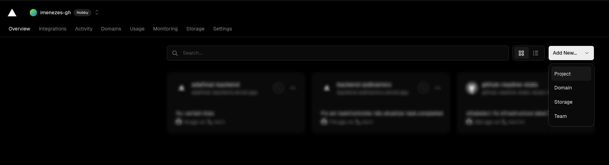
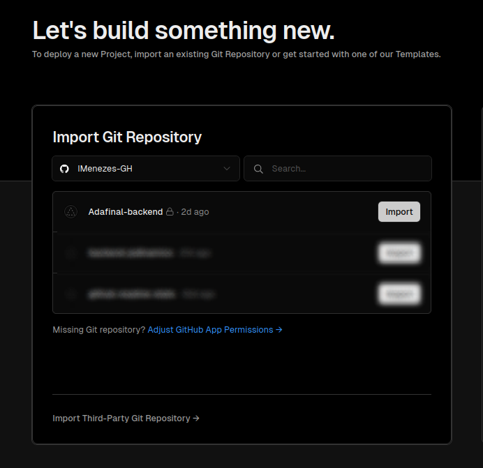
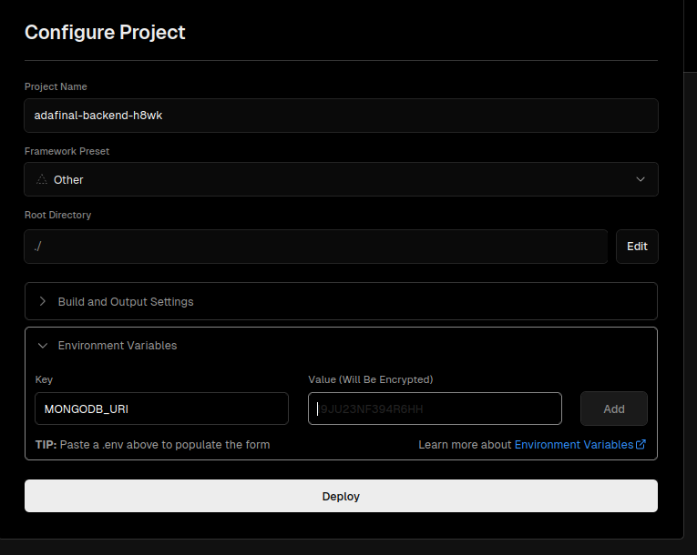
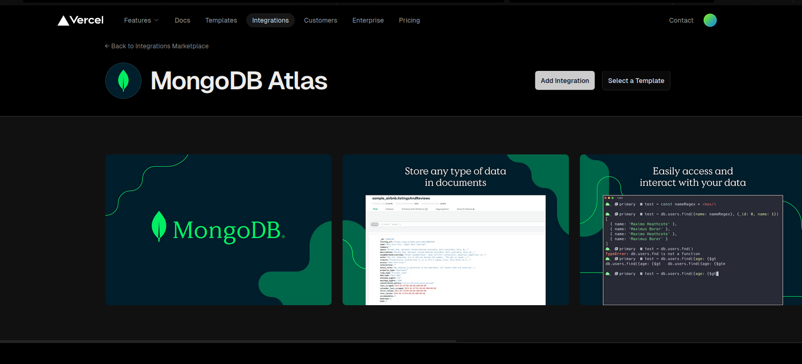

# Back-end: Projeto final <Primeiro Código />


Backend para resolução do projeto final do módulo de React do programa <Primeiro código> da ADA, utilizando um servidor express, deploy na Vercel e conexão com um cluster no MongoDB Atlas.  

[Link para a documentação do backend (swagger)](https://adafinal-backend.vercel.app/api-docs/)  
[Link para o código fonte do frontend deste projeto](https://github.com/IMenezes-GH/Adafinal-frontend)  
[Link para o deploy do frontend deste projeto](https://adafinal-frontend.vercel.app/)  

## Instruções:
Instruções para realizar o deploy do projeto self-hosted pela vercel.

#### 1 - Clone/Crie um fork desse repositório no github/gitlab/gitbucket  
#### 2 - Entre na sua conta Vercel, e clique em criar novo projeto
  

#### 3 - Selecione o repositório onde você clonou/fork desse repositório. 



#### 4 - Durante a configuração do deploy, passe as seguintes variáveis de desenvolvimento:

    MONGODB_URI=(sua URI do mongoDB atlas)  
    ACCESS_TOKEN_SECRET=(sua chave, veja abaixo como gerar) 
    REFRESH_TOKEN_SECRET=(outra chave, diferente da chave anterior)   
    SALT_KEY=10  
    SECURE_COOKIES=true  
    USE_DEVELOPMENT_ORIGINS=true (se não configurar, ou deixar false não dá para testar o frontend pelo localhost!)
    PROD_ORIGIN= (a URL onde está seu front-end)




#### 5 - Após realizar o deploy do projeto, vá na aba "integrations" da vercel e procure por "mongo"



#### 6 - Adicione a integração MongoDB Atlas na sua conta Vercel e habilite ela no seu projeto. Talvez seja necessário habilitar a integração na sua conta MongoDB Atlas também.
#### 7 - Pronto! Agora Teste as rotas do seu deploy para ver se está tudo certo.

## Gerando uma chave para o JWT:

**Requisitos: Node.js**

1 - abra o seu terminal (cmd)
2 - digite "node" e aperte enter
3 - No ambiente node, execute o seguinte comando:
```javascript
require('crypto').randomBytes(64).toString('hex')
```
4 - Copie e cole a chave gerada na variável de ambiente.
5 - Execute o comando novamente para gerar a chave do REFRESH_TOKEN_SECRET. É importante que ambas chaves sejam diferentes.
